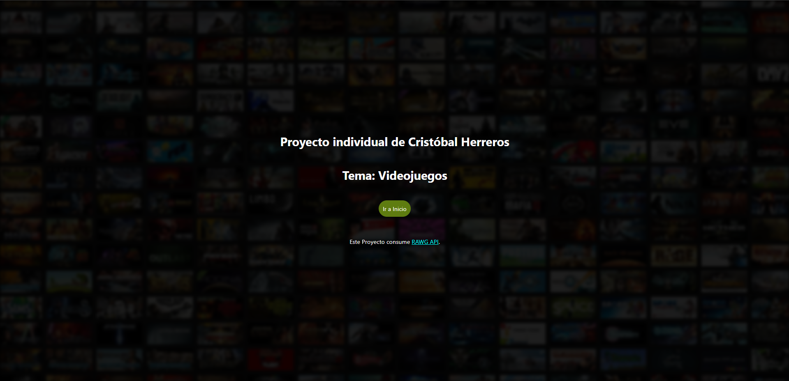
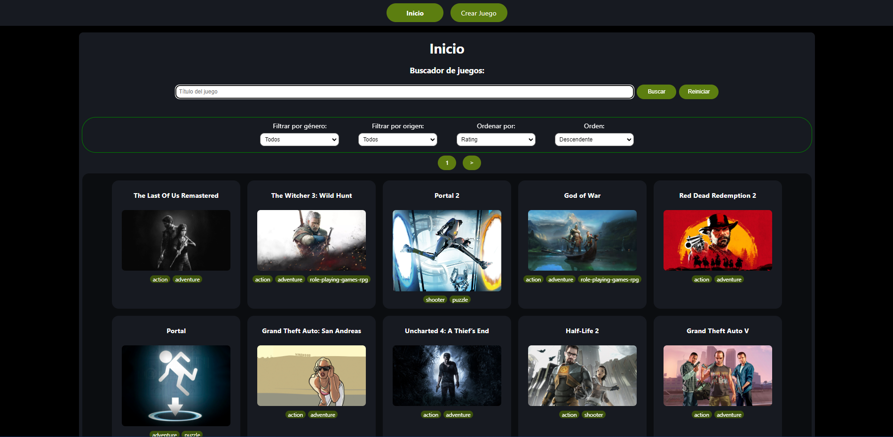
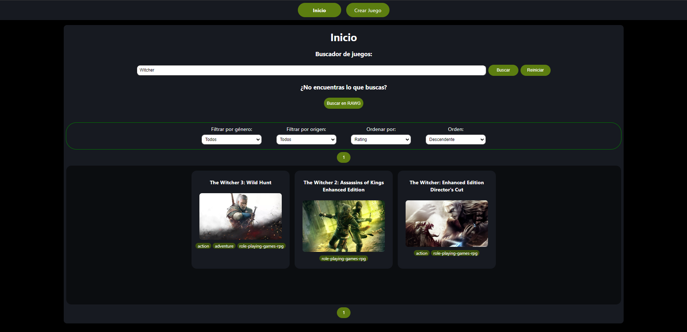
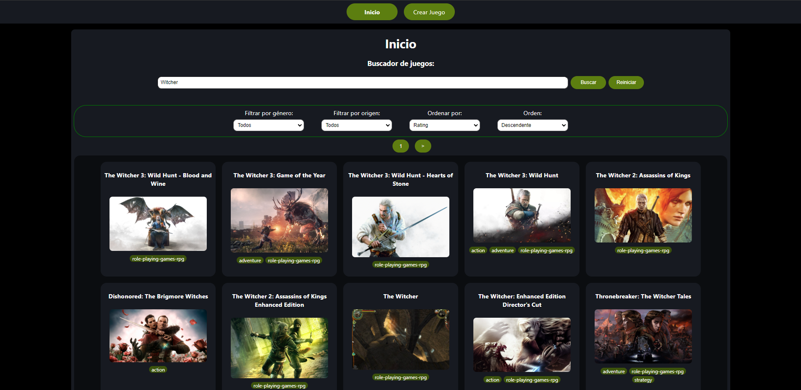
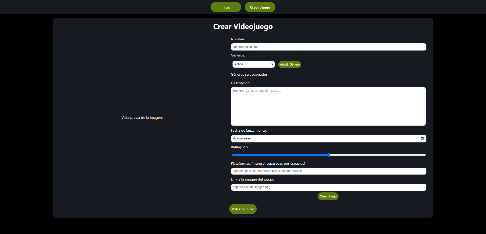
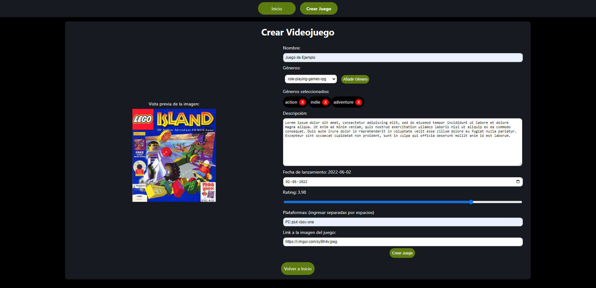
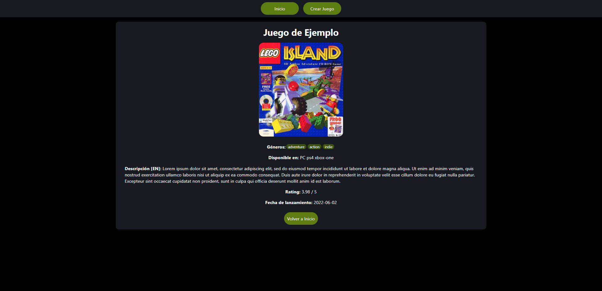
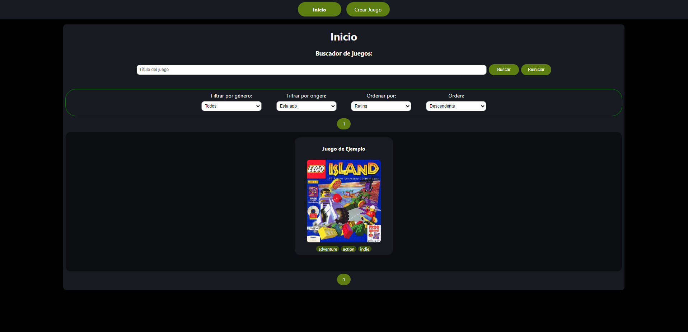

# Proyecto Individual Henry Bootcamp
## Videogames app
Esta es la versión final de la aplicación que se me pidió construir terminando [Henry Bootcamp](https://www.soyhenry.com/). Es una aplicación sencilla construida usando [React](https://es.reactjs.org/)+[Redux](https://es.redux.js.org/) en el frontend y utilizando [Node](https://nodejs.org/es/) y [Express.js](https://expressjs.com/es/) en el backend. Adicionalmente utiliza [Sequelize](https://sequelize.org/) para conectarse a una base de datos local.

## Ambiente de desarrollo
Hice este proyecto en Windows 11 con WSL 2 (Ubuntu) y utilicé:
- Node v16.13.1
- PostgreSQL 12.10

Para ver las versiones de cada dependencia usada, revisar los `package.json` dentro de las carpetas `api` y `client` respectivamente.

## Screenshots
### Pantalla de bienvenida
Como se me indicó en el enunciado: una vista con una imagen pertinente al proyecto y un botón para ingresar a la aplicación.


### Vista de inicio
La vista de inicio de la aplicación: Una barra de navegación con dos botones: "Inicio" y "Crear Juego", luego la barra de busqueda, seguida por los selectores de filtros y ordenación. Finalmente, el paginado y el display de tarjetas de juegos.

La aplicación por defecto trae 120 juegos desde la API y los guarda en la base de datos, para asi no consultar constantemente la API y agotar el número de usos asociados a la API Key.


La búsqueda es inicialmente solo en la base de datos de la aplicación. Sin embargo, luego de buscar muestra un tercer botón dando la opción de buscar en la API externa.


Luego de buscar en la API externa, el tercer botón desaparece y muestra los resultados de la búsqueda.


### Formulario de creación de juegos
En esta vista se puede ver un formulario controlado por javascript que permite añadir un juego a la aplicación. Los juegos creados en este form se guardan solo en la base de datos local.

Adicionalmente, el selector para añadir géneros es dinámico. A medida que estos se agregan en el form, también desaparecen de las opciones disponibles para escoger del selector. Aparte, si se agrega un link a una imagen en el form, esta será previsualizada al lado izquierdo.


Las validaciones verifican lo siguiente: Que el juego tenga nombre y este no tenga más de 72 caracteres, que el juego tenga al menos un género, que tenga descripción, que el rating sea un punto flotante entre cero y cinco, que tenga al menos una plataforma y que de tener un link a una imagen, la imagen no puede tener mas de 255 caracteres.


Luego de crear un juego, la aplicación te redirigirá a la **página de detalles** del juego recién creado. Esta vista es accesible para cualquier juego accediendo haciendo click en su tarjeta en la vista de inicio o accediendo directamente desde su URL.


Por último, de volver a la vista de inicio, se puede observar su tarjeta agregada sin problemas. En este último pantallazo utilizo las opciones de filtrado para mostrar solo los juegos creados por el usuario para que pueda apreciarse la tarjeta creada.


## Para levantar la aplicación
### 
Luego de clonar el repo, agregar un archivo `.env` dentro de la carpeta `api` con las siguientes variables de entorno: 

```
DB_USER=       <usuario de postgres>
DB_PASSWORD=   <contraseña de postgres>
DB_HOST=       <dirección de la base de datos de postgres>
HOSTING_PORT=  <puerto, por defecto distinto a 3000>
API_KEY=       <llave de la api de RAWG>
```
Después, instalar las dependencias dentro de las carpetas `api` y `client` con `npm install`.

Asegurarse de tener corriendo el servicio de base de datos en segundo plano (En Ubuntu, `sudo service postgresql start`).

Finalmente para levantar la aplicación, hacer `npm start` dentro de `api` y luego dentro de `client` respectivamente y luego acceder a `localhost:3000` en el navegador.